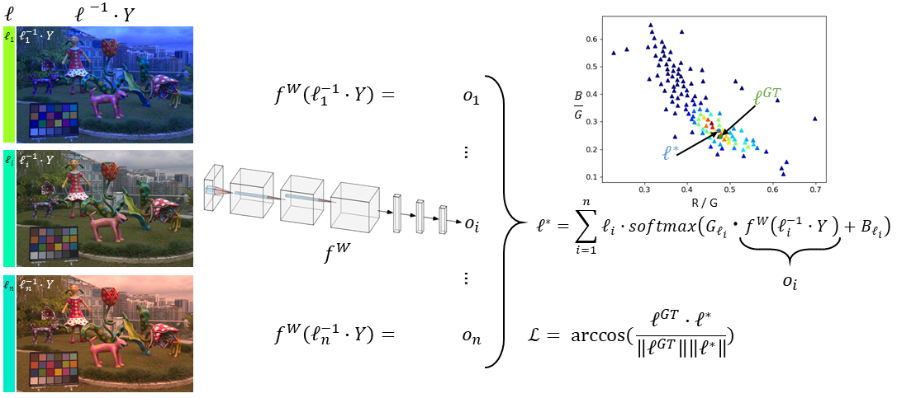
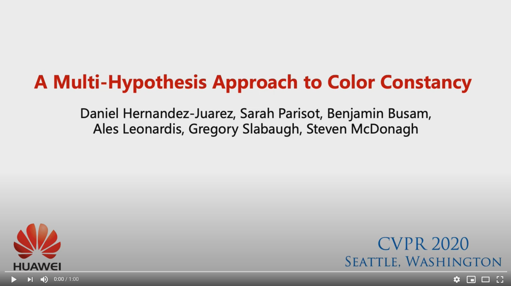

# **A Multi-Hypothesis Approach to Color Constancy**

**Daniel Hernandez-Juarez, Sarah Parisot, Benjamin Busam, Ales Leonardis, Gregory Slabaugh and Steven McDonagh**
*CVPR, 2020*

[paper](https://arxiv.org/abs/2002.12896 "A Multi-Hypothesis Approach to Color Constancy paper")/[poster](https://github.com/smcdonagh/multi_hyp_cc/blob/master/06066-poster.pdf "A Multi-Hypothesis Approach to Color Constancy poster")/[code](https://github.com/huawei-noah/multi_hyp_cc "A Multi-Hypothesis Approach to Color Constancy code")/[supplement](https://arxiv.org/abs/2002.12896)/[blog post](https://coming/soon)

*Contemporary approaches frame the color constancy problem as learning camera specific illuminant mappings. While high accuracy can be achieved on camera specific data, these models depend on camera spectral sensitivity and typically exhibit poor generalisation to new devices. Additionally, regression methods produce point estimates that do not explicitly account for potential ambiguities among plausible illuminant solutions, due to the ill-posed nature of the problem. We propose a Bayesian framework that naturally handles color constancy ambiguity via a multi-hypothesis strategy. Firstly, we select a set of candidate scene illuminants in a data-driven fashion and apply them to a target image to generate a set of corrected images. Secondly, we estimate, for each corrected image, the likelihood of the light source being achromatic using a camera-agnostic CNN. Finally, our method explicitly learns a final illumination estimate from the generated posterior probability distribution. Our likelihood estimator learns to answer a camera-agnostic question and thus enables effective multi-camera training by disentangling illuminant estimation from the supervised learning task. We extensively evaluate our proposed approach and additionally set a benchmark for novel sensor generalisation without re-training. Our method provides state-of-the-art accuracy on multiple public datasets up to 11% median angular error improvement while maintaining real-time execution.*

**CVPR2020 Paper:** [here](https://arxiv.org/abs/2002.12896 "A Multi-Hypothesis Approach to Color Constancy paper")

**CVPR2020 Poster:** [here](https://github.com/smcdonagh/multi_hyp_cc/blob/master/06066-poster.pdf "A Multi-Hypothesis Approach to Color Constancy poster")

**Noah Github Code:** [here](https://github.com/huawei-noah/multi_hyp_cc "A Multi-Hypothesis Approach to Color Constancy code") (soon)

